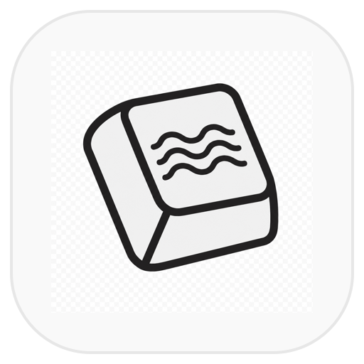

<p align="center">
  
</p>

# KeyHaptic

macOS menu bar app that makes typing and scrolling feel physical — short Force Touch trackpad taps on every keypress, and Alarm-style detent ticks when you scroll.

## Features

- **Key haptics** — click on each key down (ignores key repeat)
- **Picker scroll** — ticks while you drag *and* during momentum (like the iPhone Alarm wheel)
- **Intensities** — sliders for key strength, scroll strength, and notch spacing
- **Menu bar only** — no Dock icon, stays out of the way

## Requirements

- macOS 13+
- Force Touch trackpad (MacBook / Magic Trackpad)
- Input Monitoring + Accessibility permissions

## Install from source

```bash
git clone https://github.com/EugeneKrokhmal/KeyHaptic.git
cd KeyHaptic
./scripts/build.sh
```

That builds a release binary, writes `dist/KeyHaptic.app`, packs `dist/KeyHaptic-*.dmg`, and installs to `/Applications`.

**DMG only** (no TCC reset / no launch):

```bash
./scripts/build.sh --skip-install
open dist/KeyHaptic-*.dmg
```

Drag **KeyHaptic** → **Applications** in the disk image.

Then:

1. Enable **KeyHaptic** in **Input Monitoring**
2. Enable **KeyHaptic** in **Accessibility**
3. Hit **Quit & Reopen**

Ad-hoc rebuilds invalidate TCC — the full `./scripts/build.sh` resets those grants on purpose so you don’t get a zombie “on” toggle that silently does nothing.

## Usage

Click the menu bar icon:

| Item | What it does |
|------|----------------|
| Haptics | Master on/off |
| Picker scroll | Scroll ticks on/off |
| Intensities… | Key / scroll strength + notch size |
| Key length / frequency | Multi-pulse key feel |
| Test haptic | Fire a sample click |

## How it works

- Listens for `keyDown` and `scrollWheel` via a `CGEvent` tap (Input Monitoring), with an `NSEvent` fallback when Accessibility is granted
- Drives the trackpad through MultitouchSupport’s actuator API
- Falls back to public `NSHapticFeedbackManager` if the actuator isn’t available

> **Note:** MultitouchSupport is a private framework. That’s fine for open source / direct install. It is **not** Mac App Store–safe. For an App Store–oriented build (weaker haptics):
>
> ```bash
> swift build -c release -Xswiftc -DAPPSTORE
> ```

## Project layout

```
Sources/KeyHaptic/     Swift sources
Resources/             Info.plist, icons, entitlements
scripts/build.sh       Build → .app → DMG → /Applications
cap-icon.png           App / menu bar artwork
docs/icon.png          README hero
```

## Contributing

PRs welcome. Keep it small: this is meant to stay a thin menu bar utility.

Ideas that fit well:

- Better actuator discovery across Mac models
- Optional launch-at-login
- Separate profiles (e.g. coding vs browsing)

## License

[MIT](LICENSE)
